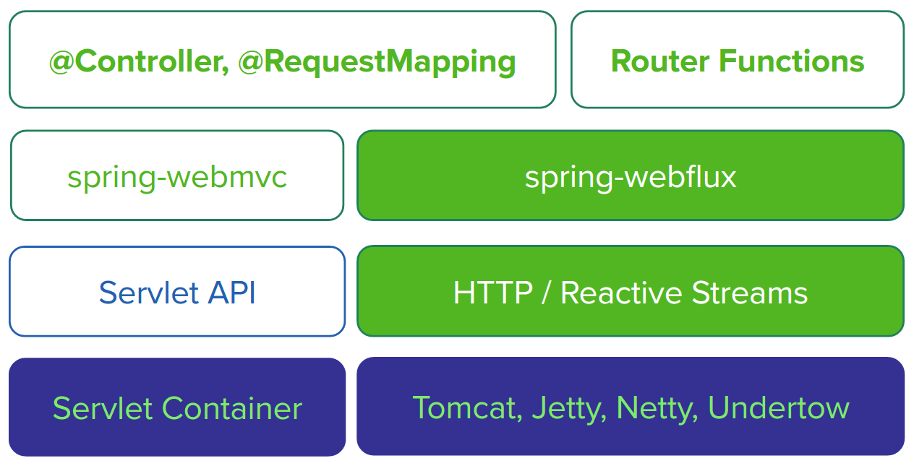
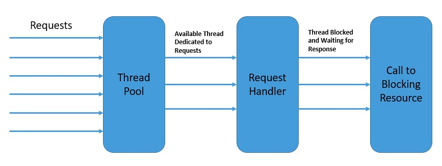
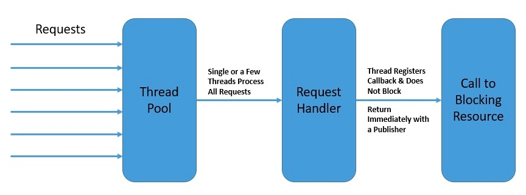
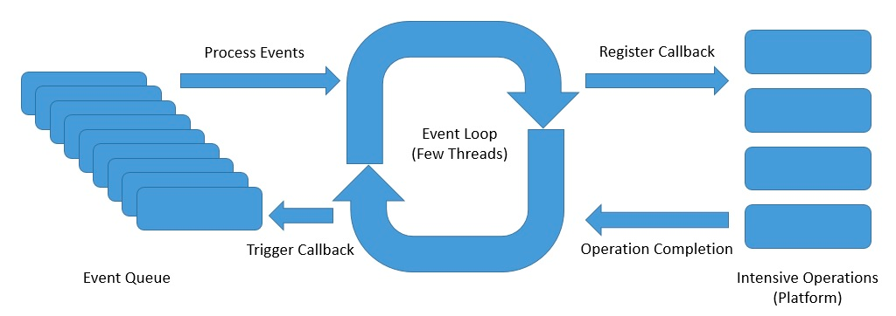
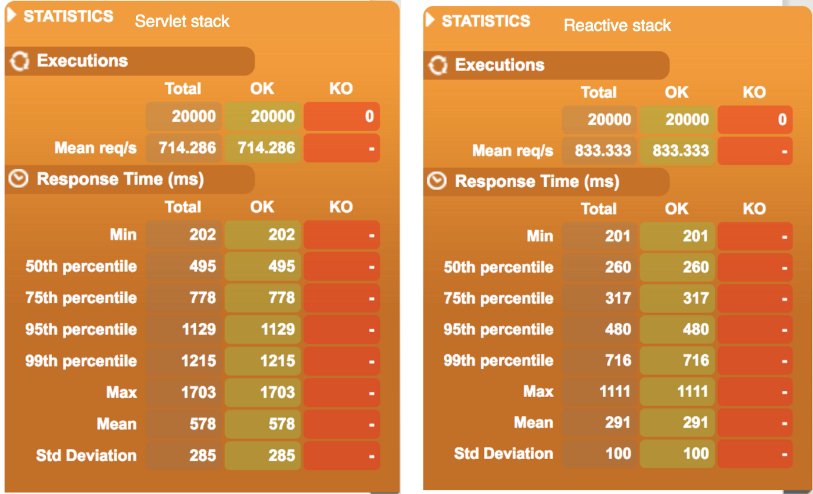
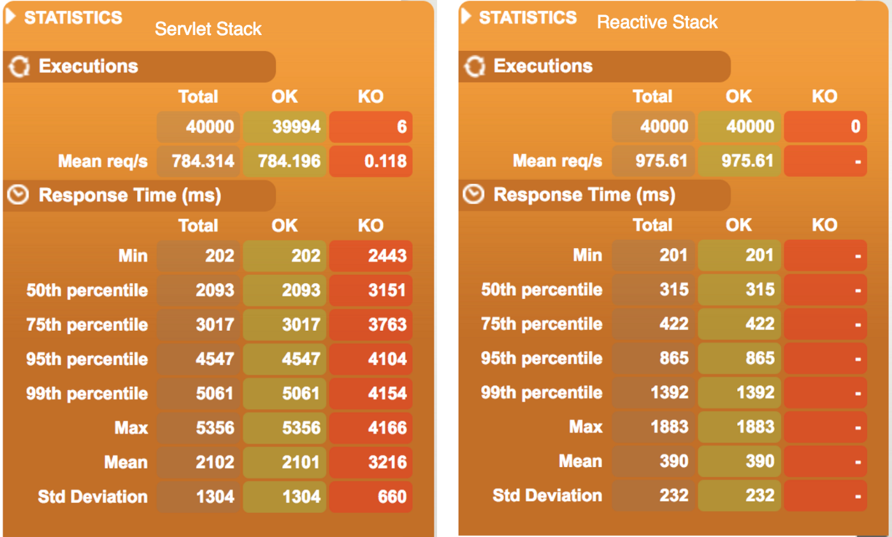
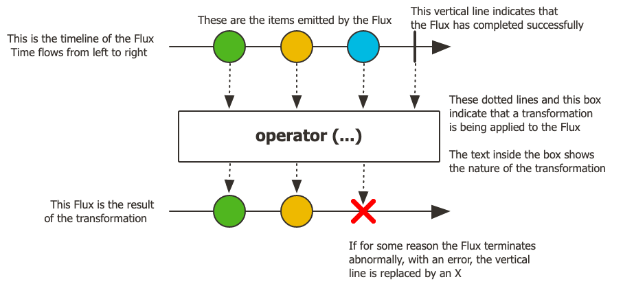
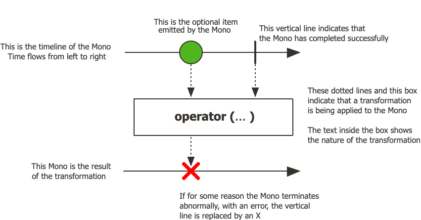

# spring-webflux项目脚手架

## 1.什么是响应式编程
1.Reactive Programming(响应式编程)
反应式编程是关于异步和事件驱动的非阻塞应用程序，并且需要少量线程来垂直扩展（即在 JVM 内）而不是水平扩展（即通过集群）。
背压技术确保生产者不会压倒消费者的机制。

2.Spring框架在内部使用Reactor来提供自己的响应式支持。
Reactor 是一个 Reactive Streams 实现，它进一步扩展了基本的 Reactive StreamsPublisher合同，
包含Flux和Mono的数据序列的声明性操作

3.Servlet和Reactive服务器堆栈对比
 

4.两种编程模型
 1.基于注解的编程模型@RestController
 2.基于函数的编程模型RouterFunctions.route

## 2.Reactor性能对比
1.线程模型
在 Spring MVC（servlet 应用程序）中，假设应用程序可以阻塞当前线程（例如，用于远程调用）。因此，servlet 容器使用大型线程池来吸收请求处理期间的潜在阻塞。
在 Spring WebFlux(一般的非阻塞服务器）中，假设应用程序不会阻塞。因此，非阻塞服务器使用一个小的、固定大小的线程池（事件循环工作者）来处理请求。

2.Reactor Netty是WebFlux的默认运行时Server，netty使用event driven事件模型为响应式异步提供高可靠的并发能力
具体参考netty的线程模型

3.Performance对比
场景：Get接口，接口内延期200ms返回，分别用5000和10000用户，每个用户并发调用4次。
测试工具： Gatling

反应式堆栈在响应时间和每秒可以处理的请求数方面具有更好的性能。
总结：基于响应式异步线程模型，可以通过少量线程处理大量并发请求的能力，对比servlet的同步阻塞IO模型，可以极大的体现线程能力，提高系统吞吐率，并能保证线程和内存资源的稳定。

## 3.Reactive Programming编程注意
Reactive Streams两大核心 Mono&Flux
1.Flux: 0 到 N 个发射项目的异步序列

2.Mono: 0-1 异步

具体参考reactive3官网

## 4.脚手架说明
1.组件：Controller、Service、ReactiveFeignClient
2.测试：Mockito单元测试、Webflux集成测试
3.DB&Cache: 引入对应db cache的reactive依赖

#参考
Reactive3 官网链接：https://projectreactor.io/docs/core/release/reference/index.html#getting-started-introducing-reactor
Spring-Webflux 官网链接：https://docs.spring.io/spring-framework/docs/5.0.0.M5/spring-framework-reference/html/web-reactive.html
